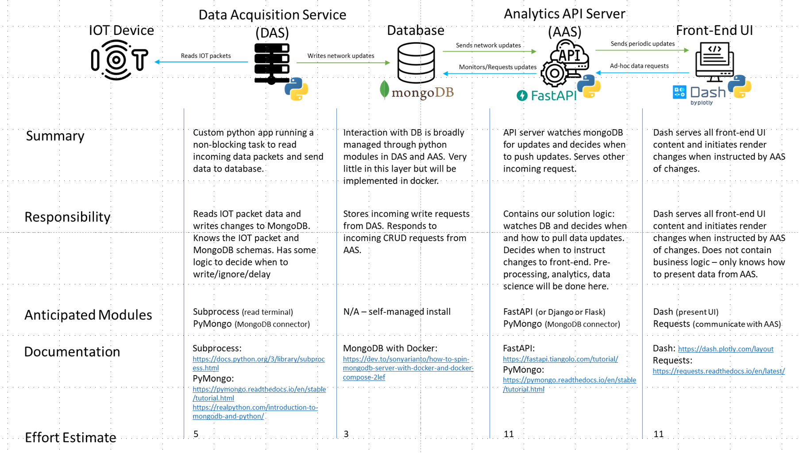
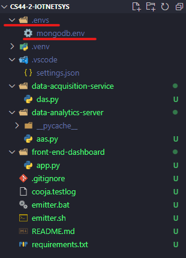

[](http://ec2-54-66-248-134.ap-southeast-2.compute.amazonaws.com/job/iotnetsys/)
<a name="readme-top"></a>

### Overview

<div align='center'>
<br/>
</div>

<!-- GETTING STARTED -->
## Getting Started
To get a local copy and run the dashboard for local testing/development follow these steps

### Installation


1. Clone the repo
   ```sh
   git clone https://github.sydney.edu.au/jomc7031/CS44-2-IOTNetSys.git
   ```

2. cd into project directory 
   ```sh
   cd CS44-2-IOTNetSys
   ```

3. Create new python development environment
   ```sh
   python -m venv .venv
   ```

4. Activate environment
   ```sh
   .venv\Scripts\activate
   ```

5. Install packages
   ```sh
   python -m pip install -r requirements.txt
   ```

6. Copy mongodb.env file to working directory. This file will be emailed to you
   ```sh
   -CS44-2-IOTNETSYS #(project folder)
      --.envs #(create this directory)
         ---mongodb.env #(copy file to .envs directory)
   ```
   <br/>

7. Run the das.py file (**DAS**). *If running on mac or linux change emitter.bat to emitter.sh in script.*<br/>
   This will start the packet data emitter and send the data to mongo cloud.
   ```sh
   python data-acquisition-service\das.py
   ```

8. Run the aas.py file (**AAS**).
   This will start the AAS and send data to the front-end periodically
   ```sh
   cd data-analytics-server # cd into AAS directory
   uvicorn aas:app --reload # start server
   ```

9. Run the app.py file (**Front-End**).
   This will start the Dash instance and publish the website to your localhost
      ```sh
      python front-end-dashboard\app.py
      ```

<p align="right">(<a href="#readme-top">back to top</a>)</p>


<!-- CONTRIBUTING -->
## Contributing

1. Clone Project
2. Create your Feature Branch from Development (`git checkout -b myFeature development`)
3. Commit your Changes (`git commit -m 'Add some AmazingFeature'`)
4. Push to the Branch (`git push origin myFeature`)
5. Open a Pull Request
6. *Do not commit to main branch*

<p align="right">(<a href="#readme-top">back to top</a>)</p>


